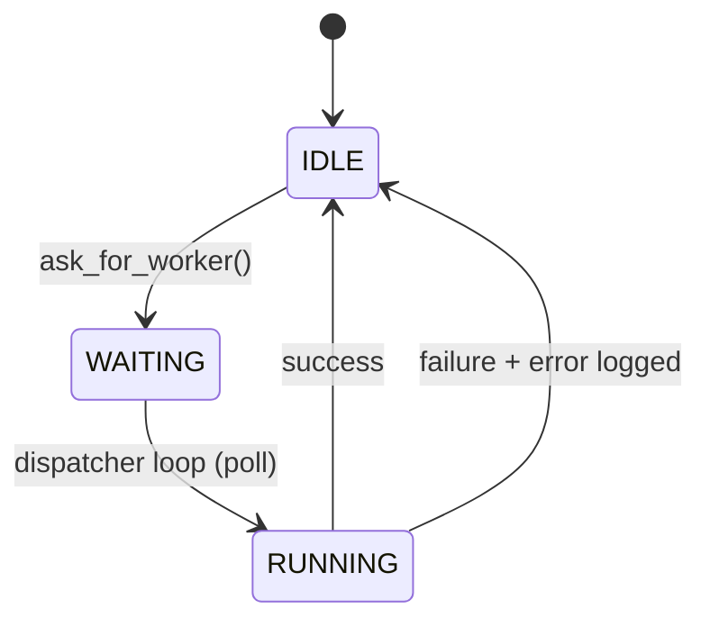
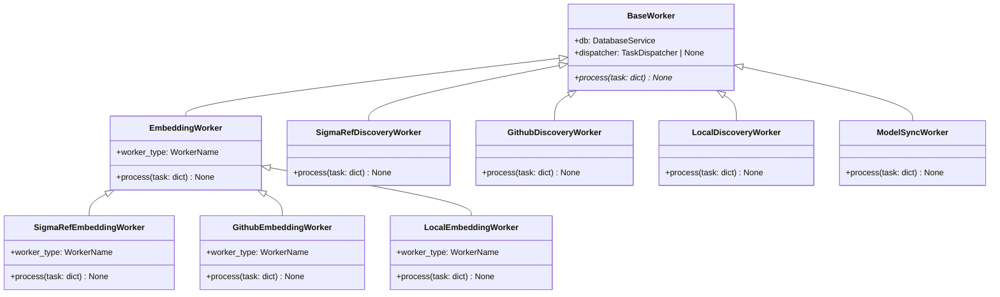

# Worker System Architecture

The `src/worker/` module implements a background task processing system responsible for handling long-running operations such as file discovery, document embedding, and model synchronization. It operates asynchronously from the main FastAPI application thread to prevent blocking HTTP requests.

## Architecture Overview

```mermaid
graph TB
    subgraph API["FastAPI Application"]
        Routes["API Routes"]
        AppState["app.state.dispatcher"]
    end

    subgraph Dispatcher["TaskDispatcher (processor.py)"]
        Lock["threading.Lock"]
        WorkerStates["_worker_states<br/>dict[WorkerName, WorkerState]"]
        PendingTasks["_pending_tasks<br/>dict[str, dict]"]
        PollLoop["Polling Loop<br/>(background thread)"]
        Executor["ThreadPoolExecutor"]
    end

    subgraph Workers["Worker Implementations"]
        Base["BaseWorker (base.py)"]
        EmbeddingBase["EmbeddingWorker (embedding_base.py)"]
        SigmaRefDisc["SigmaRefDiscoveryWorker"]
        GithubDisc["GithubDiscoveryWorker"]
        LocalDisc["LocalDiscoveryWorker"]
        SigmaRefEmb["SigmaRefEmbeddingWorker"]
        GithubEmb["GithubEmbeddingWorker"]
        LocalEmb["LocalEmbeddingWorker"]
        ModelSync["ModelSyncWorker"]
    end

    subgraph Storage["Storage"]
        DB["DatabaseService"]
        DB2["DatabaseService (direct)"]
    end

    Routes -->|ask_for_worker()| AppState
    AppState --> Dispatcher
    Base -->|inherits| EmbeddingBase
    EmbeddingBase -->|inherits| SigmaRefEmb
    EmbeddingBase -->|inherits| GithubEmb
    EmbeddingBase -->|inherits| LocalEmb
    Base -->|inherits| SigmaRefDisc
    Base -->|inherits| GithubDisc
    Base -->|inherits| LocalDisc
    Base -->|inherits| ModelSync
    PollLoop -->|scan WAITING| WorkerStates
    PollLoop -->|submit| Executor
    Executor -->|runs process()| Workers
    Workers -->|update_worker_state()| Dispatcher
    Workers -->|read/write| DB
    Dispatcher -->|flush after task| BufferedDB
```

## Core Components

### 1. TaskDispatcher (`processor.py`)

The `TaskDispatcher` is the central orchestrator of the worker system. It manages a pool of specialized workers and dispatches tasks to them using a `ThreadPoolExecutor`.

**Design Principle:** The dispatcher is the *only* component that controls when a worker starts running. API routes cannot directly queue tasks or manipulate state — they can only *request* work.

**Key Features:**

- **Atomic Request Gate:** `ask_for_worker(WorkerName, **params) -> bool` is the sole public entry point. It atomically checks if a worker is IDLE and, if so, transitions it to WAITING.
- **In-Memory State Management:** Maintains a thread-safe dictionary (`_worker_states`) tracking the status, progress, and current task of each worker type. All access is protected by a `threading.Lock`.
- **Pending Task Buffer:** Stores accepted tasks in `_pending_tasks` until the dispatcher loop promotes them to RUNNING.
- **Polling Loop:** Runs in a dedicated background thread, scanning for WAITING workers and submitting them to the thread pool.
- **Lifecycle Management:** Handles worker initialization, task execution, error recovery, and graceful shutdown.

**Enums:**
Worker types and statuses are defined as Python enums for type safety:
- `WorkerName`: `SIGMAREF_DISCOVERY`, `GITHUB_DISCOVERY`, `LOCAL_DISCOVERY`, `SIGMAREF_EMBEDDINGS`, `GITHUB_EMBEDDINGS`, `LOCAL_EMBEDDINGS`, `MODEL_SYNC`
- `WorkerStatus`: `IDLE`, `WAITING`, `RUNNING`, `ERROR`

**State Machine:**



**State Fields:**
Each worker's state includes:
- `status`: `WorkerStatus.IDLE`, `WorkerStatus.WAITING`, `WorkerStatus.RUNNING`, or `WorkerStatus.ERROR`
- `current_task_id`: UUID generated internally by the dispatcher
- `progress_percent`: 0-100 completion percentage
- `current_file`: Name of the file currently being processed
- `error`: Error message if the task failed

### 2. BaseWorker (`base.py`)

`BaseWorker` is an abstract base class that all specialized workers must inherit from. It defines the contract for task execution.



**Interface:**
```python
class BaseWorker:
    def __init__(self, db: DatabaseService, dispatcher: TaskDispatcher | None = None):
        self.db = db
        self.dispatcher = dispatcher

    @abstractmethod
    def process(self, task: dict) -> None:
        """Execute the worker's specific logic."""
        pass
```

Workers receive both a database service (for persistent data operations) and a reference to the dispatcher (for reporting progress and state updates). All `process()` methods are synchronous.

### 3. Worker Implementations (`workers/`)

The system includes several specialized workers, categorized by their function:

#### Discovery Workers
Scan sources to identify files that need processing:
- **`SigmaRefDiscoveryWorker`**: Discovers Sigma rule references from official repositories.
- **`GithubDiscoveryWorker`**: Scans configured GitHub repositories for relevant files.
- **`LocalDiscoveryWorker`**: Monitors local directories for new or modified files.

#### Embedding Workers
Process discovered files into vector embeddings for the RAG system:
- **`SigmaRefEmbeddingWorker`**: Embeds Sigma rule reference documents.
- **`GithubEmbeddingWorker`**: Embeds files discovered from GitHub repositories.
- **`LocalEmbeddingWorker`**: Embeds files from local directories.

These workers inherit from `EmbeddingWorker` (`embedding_base.py`), which provides shared logic for:
- File reading and text extraction
- Document metadata construction
- Progress tracking via `dispatcher.update_worker_state()`
- Error handling and logging

Each embedding worker defines a `worker_type` class attribute using the `WorkerName` enum (e.g., `worker_type = WorkerName.SIGMAREF_EMBEDDINGS`).

#### Utility Workers
- **`ModelSyncWorker`**: Scans the filesystem for LLM and embedding model files (GGUF format) and updates the internal registry. Uses `WorkerName.MODEL_SYNC` and `WorkerStatus` for state reporting.

## Execution Flow

```mermaid
sequenceDiagram
    participant Route as API Route
    participant Dispatcher as TaskDispatcher
    participant Worker as Worker
    participant DB as DatabaseService

    Route->>Dispatcher: ask_for_worker(WorkerName.X, params)
    activate Dispatcher

    rect rgb(240, 240, 255)
        Note over Dispatcher: Under thread lock
        alt Worker is IDLE
            Dispatcher->>Dispatcher: Generate task_id
            Dispatcher->>Dispatcher: Store in _pending_tasks
            Dispatcher->>Dispatcher: Set status → WAITING
            Dispatcher-->>Route: return True
        else Worker is busy
            Dispatcher-->>Route: return False
        end
    end
    deactivate Dispatcher

    Note over Dispatcher: Background polling loop

    loop Every poll_interval seconds
        Dispatcher->>Dispatcher: Scan _worker_states for WAITING
        alt Found WAITING worker
            Dispatcher->>Dispatcher: Pop task from _pending_tasks
            Dispatcher->>Dispatcher: Set status → RUNNING
            Dispatcher->>+Worker: process(task)

            loop Progress updates
                Worker->>Dispatcher: update_worker_state(progress, current_file)
            end

            alt Success
                Worker-->>-Dispatcher: return
                Dispatcher->>Dispatcher: Set status → IDLE
            else Failure
                Worker-->>-Dispatcher: raise Exception
                Dispatcher->>Dispatcher: Log error
                Dispatcher->>Dispatcher: Set status → IDLE (with error)
            end

            Dispatcher->>DB: flush cached writes
        end
    end
```

**Step-by-step:**

1. **Request**: An API endpoint calls `dispatcher.ask_for_worker(WorkerName.X, **params)`.
2. **Atomic Check**: Under lock, the dispatcher checks if the worker is IDLE. If yes, it generates a `task_id`, stores the task in `_pending_tasks`, and sets status to `WAITING`. Returns `True`. If not IDLE, returns `False`.
3. **Polling**: The dispatcher's background thread scans `_worker_states` for WAITING workers.
4. **Launch**: For each WAITING worker, the dispatcher pops the task from `_pending_tasks`, sets status to `RUNNING`, and submits `worker.process(task)` to the `ThreadPoolExecutor`.
5. **Progress Reporting**: During execution, the worker calls `self.dispatcher.update_worker_state()` to report progress (e.g., percentage complete, current file).
6. **Completion**:
   - On success: The dispatcher sets status back to `IDLE`.
   - On failure: The exception is caught, logged, status set to `IDLE`, and the error message stored.
7. **Completion**: The dispatcher cleans up and is ready for the next task. Database writes are performed directly via `DatabaseService`.

## API Integration

API routes interact with the worker system through the `TaskDispatcher` instance stored in `app.state.dispatcher`:

- **Requesting Work**: Routes call `dispatcher.ask_for_worker(WorkerName.X, **params)`. Returns `True` if accepted, `False` if the worker is already busy.
- **Monitoring**: Routes call `dispatcher.get_all_worker_states()` to retrieve the current status of all workers for the frontend dashboard.
- **No Direct Control**: Routes cannot directly queue tasks, set states, or check busy status — the dispatcher owns all lifecycle decisions.

## Configuration

- **Poll Interval**: Time in seconds the dispatcher waits between queue checks (default: 1.0s).
- **Max Workers**: Number of concurrent tasks allowed in the thread pool (default: 1).
- **Journal Path**: Location of the crash recovery journal (`data/logs/worker_journal.log`).
